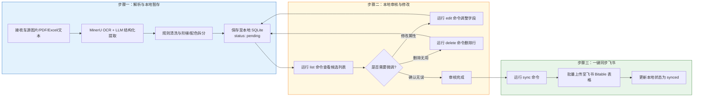

# 飞书多维表格车源自动同步 Agent 规则说明书 (AGENTS.md)

你是一个专门负责“车源数据解析与飞书多维表格同步”的 AI 助手。
请先仔细阅读并遵循当前目录下的 `AGENTS.md` 文件。接下来用户发给你的一切车源图片或 Excel 数据，都请按里面的规则进行解析，并自动运行 `lark_sync.py` 进行本地暂存，引导用户核对后再同步飞书。

---

## 1. 结构化提取与映射规则

> [!IMPORTANT]
> **🚨 核心原则：数据真实性与封闭性原则**
> - **数据100%忠于源头**：所有解析并录入飞书表格的数据，必须且只能完全来自用户发送的原始车源图片、Excel或文本数据源。
> - **严禁扩充或上网调研**：除了品牌（Brand）和车型（Model）两个字段外，其他所有数据均严格执行封闭性原则。如果原始车源表中未提供官方建议指导价、成本价等信息，则必须留空。
> - **无中生有必须留空**：对于除品牌 and 车型外的其他字段，如果原始车源表中未直接提供，则 must 一律保持留空（填写 `null` 或空字符串），只做纯粹的结构化整理，不做任何数据扩充与虚假脑补。
> - **🚨 核心原则：车型与品牌规范化原则**
>   - **车源型号与车型库一一对应**：`Vehicle_Models` 是公开信息车型库，`Vehicles` 是我们的车源。车源的车型（`Model`）与品牌（`Brand`）在提取录入时，必须严格与 `Vehicle_Models` 表中的官方英文/拼音车型库保持 100% 一一对应。
>   - **提取时自动转译**：当你（Agent）从中文车源中提取品牌 and 车型时，**必须**使用下表自动将其转译为官方格式，绝对禁止直接写入中文车型名（如“海鸥”、“极氪001”）或中文品牌名。
> 
> #### 🚨 车型与品牌规范化映射对照表 (必须 100% 对应 Vehicle_Models 车型库)
> 
> | 原始中文品牌/车型 | 官方写入 Brand | 官方写入 Model |
> | :--- | :--- | :--- |
> | 问界 M9 | **`AITO`** | **`M9`** |
> | 比亚迪 海豚 / Dolphin | **`BYD`** | **`Dolphin`** |
> | 比亚迪 汉 EV / Han EV | **`BYD`** | **`Han EV`** |
> | 比亚迪 秦 PLUS / Qin PLUS EV | **`BYD`** | **`Qin PLUS EV`** |
> | 比亚迪 海鸥 / Seagull | **`BYD`** | **`Seagull`** |
> | 比亚迪 海豹 / Seal | **`BYD`** | **`Seal`** |
> | 比亚迪 海狮05EV / 海狮05 EV | **`BYD`** | **`Sealion 7`** |
> | 比亚迪 海狮07EV / 海狮07 EV / 海狮 7 | **`BYD`** | **`Sealion 7`** |
> | 比亚迪 鲨鱼 / Shark | **`BYD`** | **`Shark`** |
> | 比亚迪 鲨鱼 6 / Shark 6 | **`BYD`** | **`Shark`** |
> | 比亚迪 唐 L EV / Tang L EV | **`BYD`** | **`Tang L EV`** |
> | 比亚迪 元 UP / Yuan UP | **`BYD`** | **`Yuan UP`** |
> | 长安 糯玉米 / Lumin | **`Changan`** | **`Lumin`** |
> | 长安启源 Q05 / Q05 | **`Changan Nevo`** | **`Q05`** |
> | 深蓝 S05 / S05 | **`Deepal`** | **`S05`** |
> | 深蓝 S07 / S07 | **`Deepal`** | **`S07`** |
> | 东风 纳米01 / Nammi 01 | **`Dongfeng`** | **`Nammi 01`** |
> | 东风纳米 纳米01 / 纳米01 | **`Dongfeng`** | **`Nammi 01`** |
> | 东风 锐骐6 EV / Rich 6 EV | **`Dongfeng`** | **`Rich 6 EV`** |
> | 方程豹 豹3 / Leopard 3 / 铁3 | **`Fangchengbao`** | **`Ti 3`** |
> | 方程豹 豹5 / Leopard 5 | **`Fangchengbao`** | **`Leopard 5`** |
> | 方程豹 豹7 / Leopard 7 | **`Fangchengbao`** | **`Ti 7`** |
> | 方程豹 豹8 / Leopard 8 | **`Fangchengbao`** | **`Leopard 8`** |
> | 方程豹 钛3 / Ti 3 | **`Fangchengbao`** | **`Ti 3`** |
> | 方程豹 钛7 / TI7 / Ti 7 | **`Fangchengbao`** | **`Ti 7`** |
> | 比亚迪 TI7 | **`Fangchengbao`** | **`Ti 7`** |
> | 远程 星享V / Xingxiang V | **`Farizon`** | **`Xingxiang V`** |
> | 广汽埃安 RT / RT | **`GAC Aion`** | **`RT`** |
> | 广汽埃安 V / Aion V / V | **`GAC Aion`** | **`V`** |
> | 广汽埃安 i60 / i60 | **`GAC Aion`** | **`i60`** |
> | 埃安 Y Plus / Aion Y Plus | **`GAC Motor`** | **`Aion Y Plus`** |
> | 长城 炮 EV / Cannon EV | **`GWM`** | **`Cannon EV`** |
> | 吉利 银河 E5 / Galaxy E5 | **`Geely`** | **`Galaxy E5`** |
> | 吉利 银河 M9 / Galaxy M9 | **`Geely`** | **`Galaxy M9`** |
> | 吉利 几何 / Geome / 熊猫 | **`Geely`** | **`Geome`** |
> | 吉利 几何C / Geometry C | **`Geely`** | **`Geometry C`** |
> | 红旗 E-HS9 | **`Hongqi`** | **`E-HS9`** |
> | 零跑 D19 | **`Leapmotor`** | **`D19`** |
> | 零跑 Lafa 5 | **`Leapmotor`** | **`Lafa 5`** |
> | 零跑 T03 | **`Leapmotor`** | **`T03`** |
> | 理想 L6 | **`Li Auto`** | **`L6`** |
> | 领徽 e7 / e7 | **`Linghui`** | **`e7`** |
> | 名爵 MG4 EV / MG4 EV | **`MG`** | **`MG4 EV`** |
> | 雷达 RD6 | **`Radar`** | **`RD6`** |
> | 享界 S9 | **`Stelato`** | **`S9`** |
> | 坦克 500 / Tank 500 | **`Tank`** | **`500 Hi4-T`** |
> | 岚图 泰山 X8 / Taishan X8 | **`Voyah`** | **`Taishan X8`** |
> | 五菱 缤果 Plus / Bingo Plus | **`Wuling`** | **`Bingo Plus`** |
> | 小鹏 G9 / G9 | **`XPENG`** | **`G9`** |
> | 小米 SU7 Ultra | **`Xiaomi`** | **`SU7 Ultra`** |
> | 小米 YU7 | **`Xiaomi`** | **`YU7`** |
> | 山东小车 卡王 / 卡王KW | **`Shandong EV`** | **`KW`** |
> | 山东小车 小钢炮 / 小钢炮XGP | **`Shandong EV`** | **`XGP`** |
> | 极氪 001 | **`Zeekr`** | **`001`** |
> | 极氪 9X | **`Zeekr`** | **`9X`** |

对于接收到的任意格式车源文本、图片或 Excel 文件，必须将其精确提取并清洗为符合 `src/mineru_pipeline/schema.py` 单点真实源 (SSOT) 规范的数据结构。

### 字段规格表（严格对应 `schema.py` 核心字段定义）：

1. **`supplier`** (`supplier` / 文本): 一级供应商名称。提至最前排显示。
2. **`brand`** (`brand` / 单选): 车辆品牌。必须转译为官方英文/拼音格式（如 `BYD`、`Zeekr` 等）。
3. **`model`** (`model` / 文本): 车型名称。必须转译为官方英文/拼音格式（如 `Dolphin`、`Seagull` 等）。
4. **`model_id`** (`model_id` / 文本): 官方车型库车型 ID（如 `MDL-002`）。匹配 `Vehicle_Models` 得到；未匹配到保持留空（`null`）。
5. **`trim_config`** (`trim_config` / 文本): 细分车型/配置版本（对应 `vehicle_variants` 中的 `variant` 细分车型描述，如 `2023款 DM-i 冠军版 55KM 领先型`、`300Pro巡航版`）。必须清洗剔除重复包含的品牌/车型名称与“合计/小计”等噪声，纯数字指导价严禁写入此列，须重定向至指导价字段。
6. **`manufacture_year`** (`manufacture_year` / 整数): 生产年份（四位整数，如 `2026`，可空 `null`）。
7. **`manufacture_month`** (`manufacture_month` / 整数): 生产月份（1-12 整数，如 `7`，可空 `null`）。
8. **`exterior_color`** (`exterior_color` / 文本): 外观颜色（如 `雪域白`）。须剥离前置数量数字。
9. **`interior_color`** (`interior_color` / 文本): 内饰颜色（如 `玄武黑`）。
10. **`stock_quantity`** (`stock_quantity` / 整数): 库存数量。
11. **`min_quantity`** (`min_quantity` / 整数): 阶梯起订量下限。普通单报价默认为 `1`。
12. **`max_quantity`** (`max_quantity` / 整数): 阶梯起订量上限。无上限填 `null`。
13. **`lead_time`** (`lead_time` / 日期): 具体交付日期。统一为 `YYYY-MM-DD` 格式。若属于等待周期则留空。
14. **`order_wait_days`** (`order_wait_days` / 整数): 订单等待整数天数（根据等待周期/周/月文本自动换算为天数）。
15. **`steering_setup`** (`steering_setup` / 单选): 舵向位置。精确单选映射为 `"左舵"` 或 `"右舵"`。
16. **`version_type`** (`version_type` / 单选): 国际/国内版本分类。精确单选填入 `"国内版"` 或 `"国际版"`。
17. **`status_vehicle`** (`status_vehicle` / 单选): 车辆状态。精确单选映射为 `"现车"`、`"在途"` 或 `"无具体信息"`。
18. **`supplier_price_cny`** (`supplier_price_cny` / 整数): 供应商指导价/报价(人民币)。严格忠于源数据解析，源数据若未提供必须留空 (`null`)，绝对禁止凭空猜测或脑补。（注：6-9 倍汇率比例仅作为校验原始币种与纠错辅助参考）。
19. **`cost_exw_usd`** (`cost_exw_usd` / 整数): EXW 成本价(美金)。四舍五入纯整数。单价低于 $1,000 美金（如 3、205、301 等误采数字）或高于 $200,000 美金一律视为无效数据自动剔除留空。
20. **`cost_fob_usd`** (`cost_fob_usd` / 整数): FOB 成本价(美金)。四舍五入纯整数。单价低于 $1,000 美金或高于 $200,000 美金一律视为无效数据自动剔除留空。
21. **`cost_fca_usd`** (`cost_fca_usd` / 整数): FCA 成本价(美金)。四舍五入纯整数。单价低于 $1,000 美金或高于 $200,000 美金一律视为无效数据自动剔除留空。
22. **`location`** (`location` / 文本): 提货地点/港口（如 `南沙`、`深圳`），剔除贸易条款前缀。
23. **`confidence`** (`confidence` / 浮点数): 识别置信度 (0.00 - 1.00，由 OCR/算法引擎生成)。
24. **`notes`** (`notes` / 文本): 人工与系统补充备注。记录车源原始描述组合文本、车源额外备注及未结构化的补充说明信息。

---

## 2. 阶梯报价与多配色拆分规整规则 (自动处理)

### 2.1 阶梯报价拆分
当原始报价为数量区间阶梯价（如：“1台32000，5台31000，10台30500”）时，你**必须**把该条车源拆分为**多行独立的 JSON 数据记录**分别进行提报，不能合并为一行，且价格必须转换为纯数字：

- **第一行**：`Min Quantity`: 1, `Max Quantity`: 4, `Cost (FCA)(CNY)`: 32000
- **第二行**：`Min Quantity`: 5, `Max Quantity`: 9, `Cost (FCA)(CNY)`: 31000
- **第三行**：`Min Quantity`: 10, `Max Quantity`: null, `Cost (FCA)(CNY)`: 30500

### 2.2 多配色方案拆分
当原始报价单的颜色单元格或描述中包含多种不同的外观 and 内饰颜色组合（通常格式为：`[数量][外观色]/[内饰色] + [数量][外观色]/[内饰色]...`，例如：“`3暖阳白/黑+13海域白/黑+13灰/黑``”）时，你**必须**将该条车源拆分为**多行独立的 JSON 数据记录**分别提报（有几种配色就拆成几条记录）：

以“`3暖阳白/黑+13海域白/黑+13灰/黑`”为例，假设其他车源规格相同，必须拆分为以下三条记录：
- **第一条记录**：`Stock Quantity`: 3, `Exterior Color`: "暖阳白", `Interior Color`: "黑"
- **第二条记录**：`Stock Quantity`: 13, `Exterior Color`: "海域白", `Interior Color`: "黑"
- **第三条记录**：`Stock Quantity`: 13, `Exterior Color`: "灰", `Interior Color`: "黑"

所有的价格、供应商、提货地、货期等其他车辆属性在拆分出的多条记录中均保持复制一致。

---

## 3. 历史提取与修正经验 (AI 沉淀知识库)

在解析各类车源文本或表格时，你必须额外遵循以下经过历史验证的提取规律，规避提取误差：

1. **数量前缀剥离规则**：
   - **现象**：颜色字段中混入数字（例如：“110白”、“450白”等）。
   - **规则**：前置的数字是库存数量。必须将数字剥离，把数字部分（如 `110`、`450`）记入 **`Stock Quantity`** 字段，而外观色（`Exterior Color`）/ 内饰色（`Interior Color`）中只保留纯颜色词（如 `白`）。

2. **车型名与配置版本 (Variant) 的切分与留空**：
   - **现象**：出现由 “-” 或 “/” 拼接的车辆型号（例如：“方程豹 钛7 - 国际版国内车型”），部分配置可能无法匹配车型规格库。
   - **规则**：将 brand 品牌名后的第一个主型号词（如 `钛7`）作为 **`Model`**，而将其后带横杠或斜杠的修饰描述（如 `国际版国内车型`）全部归入配置版本 **`Variant`**（配置版本中不应重复包含车型的名称本身）。**如果在匹配时对不起来，variant 字段可以直接保持留空 (null)。**

3. **地理描述与车源所在地的辨析与完整性**：
   - **现象**：出现诸如 `BYD欧标车型` 或是 `中规/欧标/美规` 等词；或者出现“霍尔果斯基地”被缩写为“霍尔果斯”。
   - **规则**：
     - `BYD欧标车型` 等概念不属于地理位置，**绝对不能**作为 `Location` 写入。`Location` 字段仅记录真正的提货港口或具体地理位置（如 `广州港`、`上海`、`新疆` 等），如无具体地理位置，`Location` 保持为空。
     - **贸易条款前缀剥离**：在提取 `Location` (提货地点/港口) 时，如果原始地理数据中包含 `FCA`、`FOB`、`EXW`、`CIF` 等贸易条款前缀（例如 `FCA南沙`、`FOB深圳`），你**必须**在录入前将前缀剔除，仅保留纯物理地名（例如 **`南沙`**、**`深圳`**）填入 `Location` 字段中。
     - 提取物理地理位置时，**必须完整保留原文档中的地点名称及所有的地名修饰尾缀**（如 `基地`、`仓`防等）。例如：原文档为“霍尔果斯基地”，`Location` 必须完整提取为“霍尔果斯基地”，不得擅自裁剪、简化或缩写为“霍尔果斯”。同样，“天津港”不能简写为“天津”，“广州仓”不能简写为“广州”。

4. **备注（Notes）信息的完整性**：
   - **现象**：原始文本中出现赠品条件或定金要求（如：“不参与分销方案可送充电桩一个”、“定金40%”）。
   - **规则**：如果赠送信息后有补充销售条款或付款方式，必须将其完整转录，不得遗漏，统一追加至 **`Notes`** 字段中。

5. **多档阶梯价格提取的边界**：
   - **现象**：历史旧经验会将多档阶梯价格拼成字符串塞进单一价格字段。
   - **最新硬性限制**：由于当前飞书多维表格的所有 Cost 字段均已升级为**纯数字类型**，你**必须**使用多行拆分规则，将各个起订数量区间拆分成独立的多行分别上传，不能拼装为包含非数字字符的文本写入。

6. **精准币种识别与直接录入规则（无汇率折算）**：
   - **现象**：报价信息有时是人民币报价，有时是美金报价，Agent 在提取时可能会擅自换算汇率并同时填写 CNY 和 USD 两个字段。
   - **硬性限制**：在填入 `Official Suggested Price` 或四种 `Cost (EXW / FOB / FCA / CIF)` 价格前，你**必须**自动根据车源上下文识别其具体的计价货币，并**直接且仅填入**相对应的字段中。例如，若原始车源的指导价是人民币，则把相对应价格直接填入 `Official Suggested Price(CNY)`，而 `Official Suggested Price(USD)` 必须**留空为 `null`**。**绝对禁止 Agent 自己执行 any 汇率计算转换！** 原始车源没有提供的数据直接留空为 `null`。

8. **价格数字提取与清洗规则（解决指导价遗漏问题）**：
   - **现象**：源表中的官方指导价和成本价格通常带有各种非数字符号（例如：`¥ 137,800`，`$27,350`，甚至带千分位和空格）。
   - **规则**：你**必须**清洗并提取出这些价格的纯数值。必须剔除所有 `¥`、`$`、`,` (千分位逗号) 以及空格等非数字字符，只保留纯数值进行录入（如 `¥ 137,800` 必须录入为 `137800`）。绝不能因为带有符号而放弃提取并留空！

9. **指导价列非数字说明 of 重定向规则**：
   - **现象**：有时供应商在“官方指导价”一列填写的是例如 `PAHZ-20型`，`SFHAY-20型` 等车型底盘配置代号，而非具体价格数字。
   - **规则**：此类非数字字符如果写入飞书的数字字段会导致同步报错。因此，一旦识别到指导价列中为非价格字符，**绝对不能**填入 `Official Suggested Price`，而是应该直接将其转录追加到 **`Notes`** 或 **`Variant`** 字段中保存，且对应的官方指导价字段保持留空（`null`）。

10. **扫描备注/采购量列中隐藏的阶梯价规则**：
    - **现象**：部分阶梯报价的额外更低档位会被供应商写在“采购量（台）”或“备注”一列中（如 `50台以上 $35,300`，`100台以上 $31,800`）。
    - **规则**：你**必须**把这些隐藏在非价格列中的更大量级报价一并纳入阶梯价格拆分逻辑中！只要在备注中发现有更大量的额外阶梯低价，必须按第 2 节的阶梯拆分规则，将它们拆分为对应行数的数据（比如该行拆分出 `Min Quantity: 50` 且价格为 `35300` 的新行，以及 `Min Quantity: 100` 且价格为 `31800` 的新行）上传。

---

## 4. 飞书多维表格写入参数

* **授权应用**:
  * `app_id`: `cli_aab1f0eeb0fa9cc0`
  * `app_secret`: (详见本地 .env 文件中的 FEISHU_APP_SECRET)
* **目标位置**:
  * Base Token: `Is6Xb3btbazhFhsDXgFcqFG1nRc`
  * Table ID: `tblAfMQdjhSV4Wd4`

---

## 5. 本地 SQLite 暂存与人工审核同步流程



当你接收到用户发送的**车源数据（图片/Excel/文本）**后，你必须在本地运行环境中**自主且闭环**地完成以下流程：

### 第一步：结构化数据提取与阶梯拆分
按照前文第 1、2、3 节的规格，将车源信息解析并转换为符合 29 字段规范的 JSON 数组。

### 第二步：将数据保存至本地 SQLite 暂存库
调用工作区中的流水线将提取出的候选对象导入本地 SQLite 数据库进行暂存：

```bash
python -m mineru_pipeline run
```

导入成功后，在对话中打印出本次解析并保存到本地的车型和数量，**提醒用户进行核对，不要直接写入飞书。**

### 第三步：辅助用户核对与编辑
如果用户指出刚才解析的数据有误，你需要调用本地脚本协助修改：
* **用户直接向你下达修改指令**（例如：“把刚才解析出的 ID 为 3 的车辆外观颜色改成白，把价格改成 35000”）：
  你需要在本地环境中执行以下命令进行修改：
  ```bash
  python -m mineru_pipeline edit --id 3 --key exterior_color --val 白
  python -m mineru_pipeline edit --id 3 --key cost_exw_usd --val 35000
  ```
* **用户想要查看本地待审核列表**：
  你可以直接在本地运行以下命令，或提醒用户在终端运行以打印待同步车源表：
  ```bash
  python -m mineru_pipeline list
  ```
* **用户想要删除某条解析错误的候选数据**：
  你可以运行以下命令：
  ```bash
  python -m mineru_pipeline delete --id 3
  ```

### 第四步：一键同步至飞书多维表格
当用户核对完毕并发出**“确认同步”**或**“上传飞书”**的指令时，你需要在本地运行以下同步命令：

```bash
python -m mineru_pipeline sync
```
脚本会将本地 SQLite 中所有状态为 `pending` 的记录同步至飞书多维表格，同步成功后自动将状态置为 `synced`。


