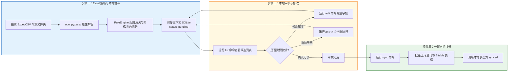

# 飞书多维表格车源自动同步 Agent 规则说明书 (AGENTS.md)

你是一个专门负责“车源 Excel 数据解析与飞书多维表格同步”的 AI 助手。
本工程已全面重构升级为 **100% 原生 Excel 极速解析架构**（免去一切 OCR 干扰），并支持 **4 级标准目录结构**元数据自动继承。

---

## 1. 结构化提取与映射规则

> [!IMPORTANT]
> **🚨 核心原则：数据真实性与目录上下文继承**
> - **100% 原生 Excel 数据源**：所有解析并录入飞书表格的数据，均直接来自原生 Excel 表格及 4 级标准目录层级。
> - **4 级目录上下文自动继承**：
>   - **1 级文件夹**：供应商 `Supplier`（如 `广州恩特湃`）
>   - **2 级文件夹**：提货地点 `Location`（如 `南沙` / `霍尔果斯基地`）
>   - **3 级文件夹**：品牌 `Brand`（如 `BYD`）
>   - **4 级文件夹**：具体车型 `Model`（如 `海狮05`）
>   - 若源 Excel 文件名极其简单（如 `价格表.xlsx`），单元格未写明品牌/车型/地点/供应商，系统将**自动从 4 级目录路径中提取继承**，绝不丢失任何上下文。
> - **数据100%忠于源头**：除了品牌（Brand）和车型（Model）由字典规范为英文/拼音外，其他非提供字段一律保持留空（`null`），严禁脑补与扩充。
> - **🚨 车型与品牌规范化原则**：车型 (`Model`) 与品牌 (`Brand`) 必须转译为官方英文/拼音格式，严格遵循配置文件 `config/brand_model_mapping.json` 与 `src/mineru_pipeline/schema.py`。

### 2. 字段规格与单点真实源 (SSOT)

对于接收到的任意格式车源文本、图片或 Excel 文件，必须将其精确提取并清洗为符合 **`src/mineru_pipeline/schema.py`** 单点真实源 (SSOT) 规范的数据结构。

所有 24 个字段的具体定义、数据类型（如数字必须为 INTEGER）、枚举约束（如舵向: 左舵/右舵，国内版自动确定为左舵）及处理边界，均**严格以 `src/mineru_pipeline/schema.py` 中的 `VEHICLE_FIELDS` 声明为准**。

---

## 2. 阶梯报价与多配色拆分规整规则 (自动处理)

### 2.1 阶梯报价拆分
当原始报价为数量区间阶梯价（如：“1台32000，5台31000，10台30500”）时，你**必须**把该条车源拆分为**多行独立的 JSON 数据记录**分别进行提报，不能合并为一行，且价格必须转换为纯数字：

- **第一行**：`Min Quantity`: 1, `Max Quantity`: 4, `Cost (FCA)(CNY)`: 32000
- **第二行**：`Min Quantity`: 5, `Max Quantity`: 9, `Cost (FCA)(CNY)`: 31000
- **第三行**：`Min Quantity`: 10, `Max Quantity`: null, `Cost (FCA)(CNY)`: 30500

### 2.2 多配色方案拆分
当原始报价单的颜色单元格或描述中包含多种不同的外观 and 内饰颜色组合（通常格式为：`[数量][外观色]/[内饰色] + [数量][外观色]/[内饰色]...`，例如：“`3暖阳白/黑+13海域白/黑+13灰/黑``”）时，你**必须**将该条车源拆分为**多行独立的 JSON 数据记录**分别提报（有几种配色就拆成几条记录）：

以“`3暖阳白/黑+13海域白/黑+13灰/黑`”为例，假设其他车源规格相同，必须拆分为以下三条记录：
- **第一条记录**：`Stock Quantity`: 3, `Exterior Color`: "暖阳白", `Interior Color`: "黑"
- **第二条记录**：`Stock Quantity`: 13, `Exterior Color`: "海域白", `Interior Color`: "黑"
- **第三条记录**：`Stock Quantity`: 13, `Exterior Color`: "灰", `Interior Color`: "黑"

所有的价格、供应商、提货地、货期等其他车辆属性在拆分出的多条记录中均保持复制一致。

---

## 3. 历史提取与修正经验 (AI 沉淀知识库)

在解析各类车源文本或表格时，你必须额外遵循以下经过历史验证的提取规律，规避提取误差：

1. **数量前缀剥离规则**：
   - **现象**：颜色字段中混入数字（例如：“110白”、“450白”等）。
   - **规则**：前置的数字是库存数量。必须将数字剥离，把数字部分（如 `110`、`450`）记入 **`Stock Quantity`** 字段，而外观色（`Exterior Color`）/ 内饰色（`Interior Color`）中只保留纯颜色词（如 `白`）。

2. **车型名与配置版本 (Variant) 的切分与留空**：
   - **现象**：出现由 “-” 或 “/” 拼接的车辆型号（例如：“方程豹 钛7 - 国际版国内车型”），部分配置可能无法匹配车型规格库。
   - **规则**：将 brand 品牌名后的第一个主型号词（如 `钛7`）作为 **`Model`**，而将其后带横杠或斜杠的修饰描述（如 `国际版国内车型`）全部归入配置版本 **`Variant`**（配置版本中不应重复包含车型的名称本身）。**如果在匹配时对不起来，variant 字段可以直接保持留空 (null)。**

3. **地理描述与车源所在地的辨析与完整性**：
   - **现象**：出现诸如 `BYD欧标车型` 或是 `中规/欧标/美规` 等词；或者出现“霍尔果斯基地”被缩写为“霍尔果斯”。
   - **规则**：
     - `BYD欧标车型` 等概念不属于地理位置，**绝对不能**作为 `Location` 写入。`Location` 字段仅记录真正的提货港口或具体地理位置（如 `广州港`、`上海`、`新疆` 等），如无具体地理位置，`Location` 保持为空。
     - **贸易条款前缀剥离**：在提取 `Location` (提货地点/港口) 时，如果原始地理数据中包含 `FCA`、`FOB`、`EXW` 等贸易条款前缀（例如 `FCA南沙`、`FOB深圳`），你**必须**在录入前将前缀剔除，仅保留纯物理地名（例如 **`南沙`**、**`深圳`**）填入 `Location` 字段中。
     - 提取物理地理位置时，**必须完整保留原文档中的地点名称及所有的地名修饰尾缀**（如 `基地`、`仓`防等）。例如：原文档为“霍尔果斯基地”，`Location` 必须完整提取为“霍尔果斯基地”，不得擅自裁剪、简化或缩写为“霍尔果斯”。同样，“天津港”不能简写为“天津”，“广州仓”不能简写为“广州”。

4. **备注（Notes）信息的完整性**：
   - **现象**：原始文本中出现赠品条件或定金要求（如：“不参与分销方案可送充电桩一个”、“定金40%”）。
   - **规则**：如果赠送信息后有补充销售条款或付款方式，必须将其完整转录，不得遗漏，统一追加至 **`Notes`** 字段中。

5. **多档阶梯价格提取的边界**：
   - **现象**：历史旧经验会将多档阶梯价格拼成字符串塞进单一价格字段。
   - **最新硬性限制**：由于当前飞书多维表格的所有 Cost 字段均已升级为**纯数字类型**，你**必须**使用多行拆分规则，将各个起订数量区间拆分成独立的多行分别上传，不能拼装为包含非数字字符的文本写入。

6. **精准币种识别与美金换算规则（固定汇率 6.7）**：
   - **硬性规则**：
     1. 系统中的外贸价格字段 `Cost (EXW / FOB / FCA)` 均为 **USD 美金字段**。
     2. **直接美金报价**：若原始车源报价为美金（或包含 `$` / `USD` / 表头为 `EXW` / `FCA` / `FOB` 且未标人民币），剔除符号后直接填入对应的 `cost_exw_usd` / `cost_fca_usd` / `cost_fob_usd`。
     3. **人民币外贸报价换算**：若原始 EXW / FCA / FOB 报价明确标注为人民币（例如 `FCA 52600元` 或表头注明 `FCA人民币`），你**必须**使用固定汇率 **`6.7`** 进行换算（即 `美金金额 = 人民币金额 / 6.7`，四舍五入取整），并填入对应的 `cost_exw_usd` / `cost_fca_usd` / `cost_fob_usd` 字段中！同时可将原始人民币价格保留在 `supplier_price_cny` 或 `Notes` 中。
   - 注意：**CIF 价格字段已废弃，不再收集，如遇到 CIF 报价请忽略。**
   - 同一行同时出现 EXW/FCA/FOB 多个价格时，必须分别计算并保留到对应字段，不能三选一。

8. **价格数字提取与清洗规则（解决指导价遗漏问题）**：
   - **现象**：源表中的官方指导价和成本价格通常带有各种非数字符号（例如：`¥ 137,800`，`$27,350`，甚至带千分位和空格）。
   - **规则**：你**必须**清洗并提取出这些价格的纯数值。必须剔除所有 `¥`、`$`、`,` (千分位逗号) 以及空格等非数字字符，只保留纯数值进行录入（如 `¥ 137,800` 必须录入为 `137800`）。绝不能因为带有符号而放弃提取并留空！

9. **指导价列非数字说明 of 重定向规则**：
   - **现象**：有时供应商在“官方指导价”一列填写的是例如 `PAHZ-20型`，`SFHAY-20型` 等车型底盘配置代号，而非具体价格数字。
   - **规则**：此类非数字字符如果写入飞书的数字字段会导致同步报错。因此，一旦识别到指导价列中为非价格字符，**绝对不能**填入 `Official Suggested Price`，而是应该直接将其转录追加到 **`Notes`** 或 **`Variant`** 字段中保存，且对应的官方指导价字段保持留空（`null`）。

10. **扫描备注/采购量列中隐藏的阶梯价规则**：
    - **现象**：部分阶梯报价的额外更低档位会被供应商写在“采购量（台）”或“备注”一列中（如 `50台以上 $35,300`，`100台以上 $31,800`）。
    - **规则**：你**必须**把这些隐藏在非价格列中的更大量级报价一并纳入阶梯价格拆分逻辑中！只要在备注中发现有更大量的额外阶梯低价，必须按第 2 节的阶梯拆分规则，将它们拆分为对应行数的数据（比如该行拆分出 `Min Quantity: 50` 且价格为 `35300` 的新行，以及 `Min Quantity: 100` 且价格为 `31800` 的新行）上传。

12. **外贸条款价格合理性校验与基准差价**：
    - **现象**：同一车辆可能包含多个外贸条款报价（EXW / FCA / FOB），需要验证价格逻辑合理性，防止数据倒挂或异常。
    - **规则**：
      - **`EXW → FCA`** 递增基准：约 **+$500 USD**（允许根据实际陆运距离与箱量分摊合理浮动）。
      - **`FCA → FOB`** 递增基准：约 **+$500 USD**（主要为港杂费与离岸报关关务费）。
      - **`EXW → FOB`** 递增基准：约 **+$1000 USD**。
      - 当同一车源提取出多个外贸条款价格时，必须遵循 `Cost (FOB) > Cost (FCA) > Cost (EXW)` 的递增逻辑。若出现价格倒挂或异常偏离，需触发校验警告并记录入 **`Notes`**。

---

## 4. 飞书多维表格写入参数与红线安全规则

> [!CAUTION]
> **🚨 核心安全红线规则：生产环境表格绝对只读！**
> - **生产环境表格 ID**: `tblte61W3fKoXmSw` （URL: `https://ecn4k98ibq2i.feishu.cn/base/Is6Xb3btbazhFhsDXgFcqFG1nRc?table=tblte61W3fKoXmSw`）
> - **原则与约束**：**该生产环境表格仅用于 AI 读取参考字段格式或拉取线索，绝对严禁任何形式的写入（Create）、修改（Update）、清空（Clear）或删除（Delete）操作！避免造成生产数据事故！**
> - **唯一可写/同步目标**：所有调试、测试、手动同步、CLI `sync` 操作**必须且只能作用于开发测试表格 `tblgSRsRQ3zFr0fz`**。

* **授权应用**:
  * `app_id`: `cli_aab1f0eeb0fa9cc0`
  * `app_secret`: (详见本地 .env 文件中的 FEISHU_APP_SECRET)
* **目标位置**:
  * Base Token: `Is6Xb3btbazhFhsDXgFcqFG1nRc`
  * **全新开发测试表格 (可读写)**: `tblAxwCCmDIG4xfx`
  * **生产环境表格 (🚨 仅只读/绝对严禁写删)**: `tblte61W3fKoXmSw`

---

## 5. 本地 SQLite 暂存与人工审核同步流程



当你接收到用户发送的**车源数据（图片/Excel/文本）**后，你必须在本地运行环境中**自主且闭环**地完成以下流程：

### 第一步：结构化数据提取与阶梯拆分
按照前文第 1、2、3 节的规格，将 Excel/CSV 车源信息解析并转换为符合 `src/mineru_pipeline/schema.py` 单点真实源规范的候选数组。

### 第二步：将数据保存至本地 SQLite 暂存库
调用工作区中的流水线将提取出的候选对象导入本地 SQLite 数据库进行暂存：

```bash
python -m mineru_pipeline run
```

导入成功后，在对话中打印出本次解析并保存到本地的车型和数量，**提醒用户进行核对，不要直接写入飞书。**

### 第三步：辅助用户核对与编辑
如果用户指出刚才解析的数据有误，你需要调用本地脚本协助修改：
* **用户直接向你下达修改指令**（例如：“把刚才解析出的 ID 为 3 的车辆外观颜色改成白，把价格改成 35000”）：
  你需要在本地环境中执行以下命令进行修改：
  ```bash
  python -m mineru_pipeline edit --id 3 --key exterior_color --val 白
  python -m mineru_pipeline edit --id 3 --key cost_exw_usd --val 35000
  ```
* **用户想要查看本地待审核列表**：
  你可以直接在本地运行以下命令，或提醒用户在终端运行以打印待同步车源表：
  ```bash
  python -m mineru_pipeline list
  ```
* **用户想要删除某条解析错误的候选数据**：
  你可以运行以下命令：
  ```bash
  python -m mineru_pipeline delete --id 3
  ```

### 第四步：一键同步至飞书多维表格
当用户核对完毕并发出**“确认同步”**或**“上传飞书”**的指令时，你需要在本地运行以下同步命令：

```bash
python -m mineru_pipeline sync
```
脚本会将本地 SQLite 中所有状态为 `pending` 的记录同步至飞书多维表格，同步成功后自动将状态置为 `synced`。


---

## 6. 标准运行流与规则自动提炼防越权约束 (SOP & Governance Rules)

为了确保后续任何 AI Agent（或开发者脚本）接手本工程时都能遵循同一套**“自我学习闭环”**，所有 AI 助手必须严格遵循以下三层约束：

### 6.1 强制使用标准 CLI 修正命令（严禁直接写数据库）
- **🚨 铁律**：当需要修改或校正任何候选车源数据时，**必须且只能**调用标准 CLI 命令：
  ```bash
  python -m mineru_pipeline edit --id <id> --key <field> --val <value>
  ```
- **❌ 严禁行为**：**绝对禁止** Agent 直接编写 Python 代码或 Bash 执行 SQLite 原生 `UPDATE source_candidates ...` SQL 语句！
- **为什么必须这样**：因为直接操作 SQLite 会绕过系统的 **`RuleEngine` 提炼引擎**，导致系统无法自动学习该次修改，从而在下次遇到同类数据时重蹈覆辙。使用 `edit` 命令会自动触发规则蒸馏并持久化到 `config/rules_knowledge_base.json`。

### 6.2 5 步标准运行流 (Standard Agent SOP)
任何 AI Agent 接手工作时，必须严格按照以下 SOP 顺序执行：
1. **解析提取与暂存**：`python -m mineru_pipeline run`
2. **候选结果盘点**：`python -m mineru_pipeline list`
3. **交互校对与规则学习**：`python -m mineru_pipeline edit --id <id> --key <key> --val <val>`（自动蒸馏规则）
4. **废弃废件删除**：`python -m mineru_pipeline delete --id <id>`
5. **一键同步飞书**：`python -m mineru_pipeline sync`

### 6.3 零 AI Token 消耗保障与验证
- 每次运行 `python -m mineru_pipeline run` 结束后，必须检查并向用户汇报控制台打印的 **Schema Intelligence Telemetry Report**，确认确定性极速引擎 (Deterministic Fast-Path) 命中率维持在 95%+ 以上。


