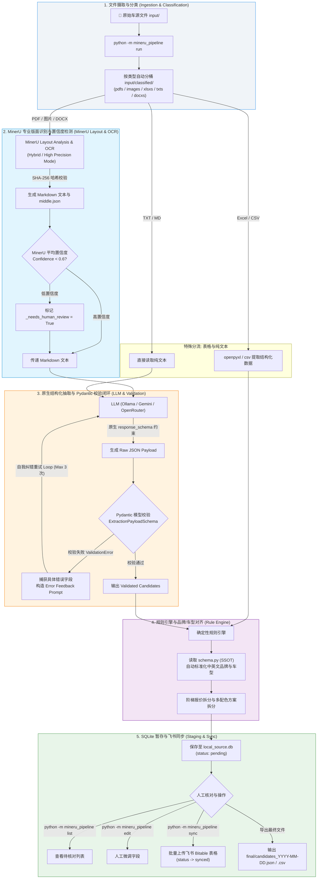

# 新流程
                 用户上传文件

                       │

              文件类型识别 Router

                       │

        ┌──────────────┼──────────────┐
        │              │              │

      PDF等            excel等        markdown/Text等
        │              │              │

        │              │              │

    MinerU SDK      结构化精准提取    转化为结构化
        │              │              │

        └──────────────┼──────────────┘

                       │

              统一中间格式层

        Markdown + Table + Metadata

                       │

          文档结构分析 / Semantic Chunking

        （按表格、章节、段落切，不硬截断）

                       │

              LLM Structured Extraction

        JSON Schema / Function Calling

                       │

              Pydantic 数据校验

        ┌──────────────┴──────────────┐
        │                             │

      成功                          失败

        │                             │

        │                       自动修复/重试

        │

              Business Rule Engine

        （业务规则，不放 Prompt）

        ├─ 品牌标准化
        ├─ 车型映射
        ├─ 单位转换
        ├─ 字段补全
        └─ 去重合并


                       │

              Data Quality Check

        ├─ 必填字段检查
        ├─ 异常价格检查
        ├─ 重复车型检查
        └─ 人工审核（可选）


                       │

              最终业务数据库

              🚗 结构化车辆表




## 核心演进亮点

1. **原生的结构化输出 (`response_schema`)**：
   透传 Pydantic 生成的 JSON Schema 给 Gemini API，在 Token 解码阶段直接锁定语法树，实现 100% 格式确定性。
2. **Pydantic 校验与智能重试闭环 (Self-Correction Loop)**：
   如果 LLM 输出的 JSON 未通过 Pydantic 类型或范围校验，系统会自动捕获 `ValidationError` 详细报错，反向注入下一次 Prompt 进行自我修复，而非直接写入数据库。
3. **MinerU OCR 置信度感知 (Confidence Thresholding)**：
   自动读取 MinerU 导出的 `middle.json`，若文字/表格平均置信度低于 0.6，自动标记 `_needs_human_review = True`，防止隐形脏数据污染。
4. **断点续跑与缓存复用 (SHA-256 Checkpoint)**：
   利用文件 SHA-256 哈希比对，已处理的文件自动跳过，支持海量文档大批次解析时的断点续跑。

## 安装与使用

```bash
pip install -e .
export MINERU_BACKEND=pipeline
python -m mineru_pipeline
```

